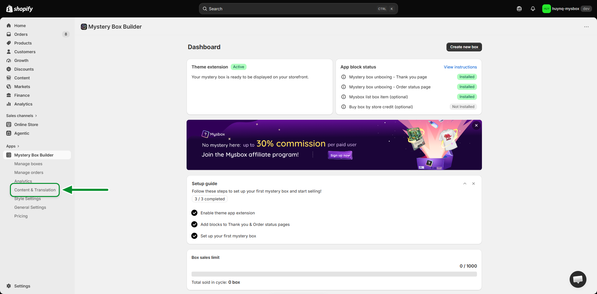
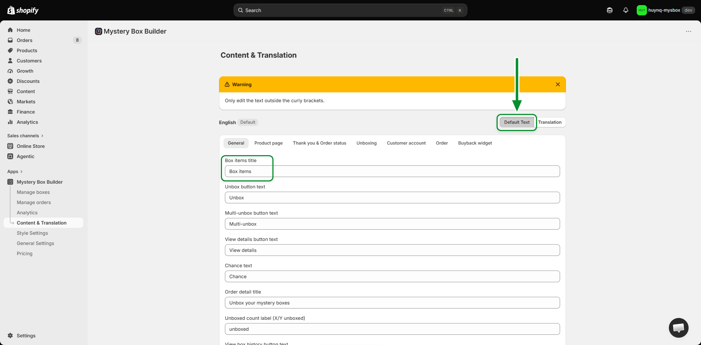
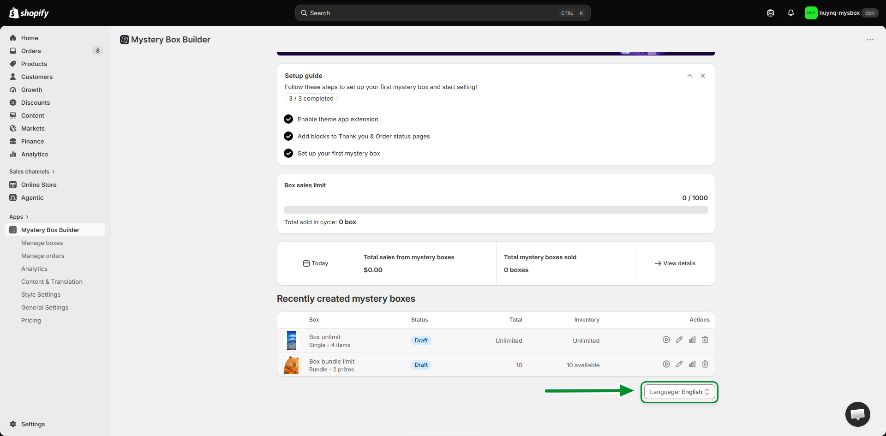
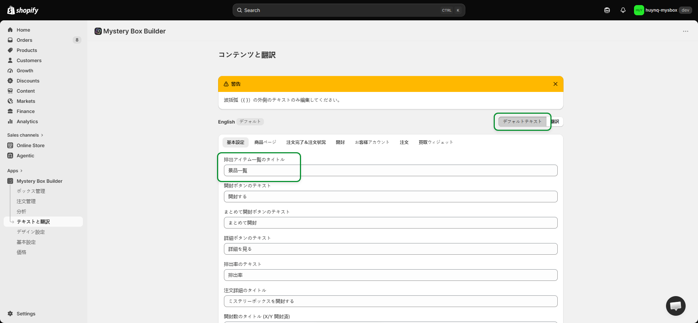
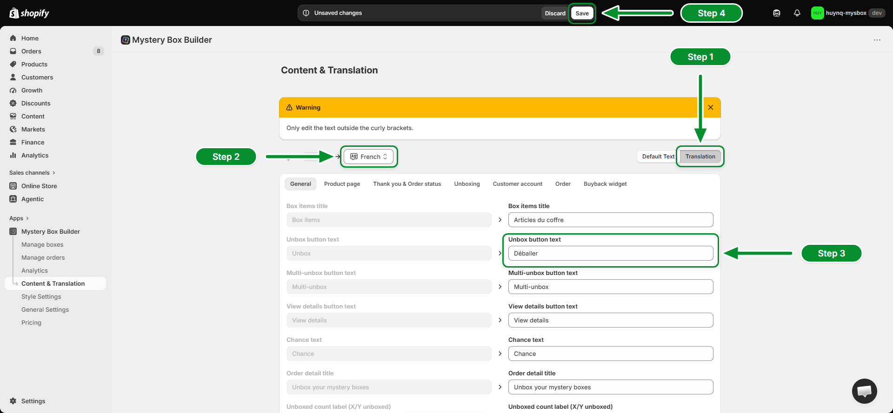

# Setting Up Translations in Mystery Box Builder

## What it does
Mystery Box Builder keeps all of its on-screen text — button labels, titles, messages — in one place. From **Content & Translation** you can edit that text for your store's default language and translate it into every other language your store supports.

## 1. Open Content & Translation

From the Mystery Box Builder dashboard, open **Content & Translation** in the left-hand menu. This page is where you edit the app's text and manage translations.

## 2. Edit the default text (English)

The **Default Text** tab (selected by default) holds the app's original copy, shown here in **English**. Pick a section — General, Product page, Unboxing, and so on — then edit any field. The **Box items title** field below, for example, currently reads "Box items". Click **Save** when you're done.

> **Important:** Only edit the text outside the curly braces `{ }`. Text inside them controls dynamic values, like item counts, and must stay unchanged.

**Optional: prefill the default text with ready-made Japanese copy**

Mystery Box Builder can prefill the Default Text tab with ready-made Japanese copy instead of typing every field by hand.

On the **Dashboard**, scroll down and change the **Language** dropdown to **日本語**. This only changes the app's own admin language, not your store's customer-facing default language.

Open **Content & Translation** again — every field on the Default Text tab is now filled in with Japanese copy automatically; the **Box items title** field, for example, now reads **景品一覧** instead of "Box items". Edit any one field slightly (for example, add a space) and click **Save** to keep this Japanese text.

> **Note:** Switch the Language dropdown back to English afterwards if you don't want the app's admin menu to stay in Japanese — your saved default text won't change either way.

## 3. Translate into your store's other languages

Switch to the **Translation** tab. Pick a language from the dropdown — **French** is shown here. The left column is the read-only default text; type your translation into the matching field on the right, like **Unbox button text**. Click **Save** in the bar at the top to publish it.

> **Note:** Repeat this for every language your store supports, and for the other tabs (Product page, Unboxing, Customer account, etc.) to fully translate the widget.
