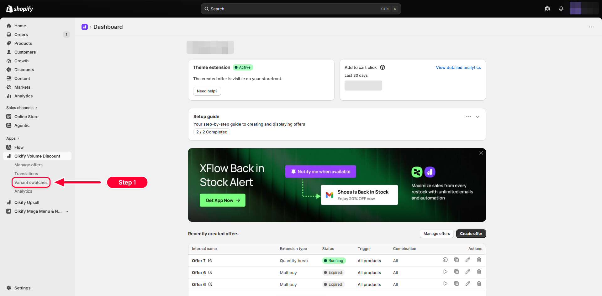
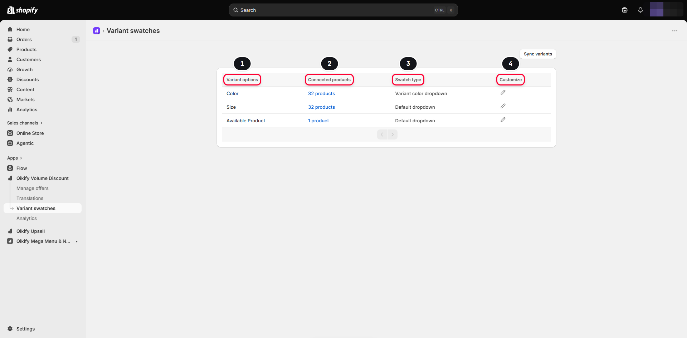
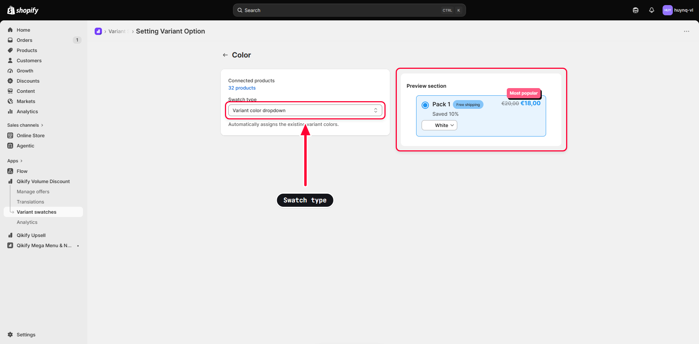
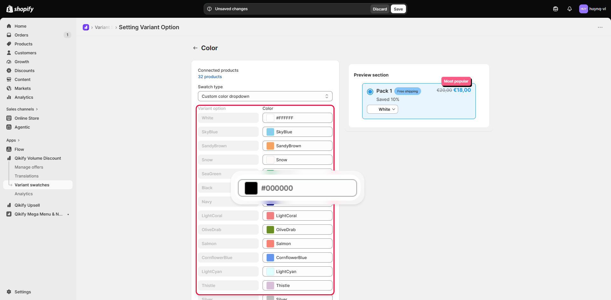
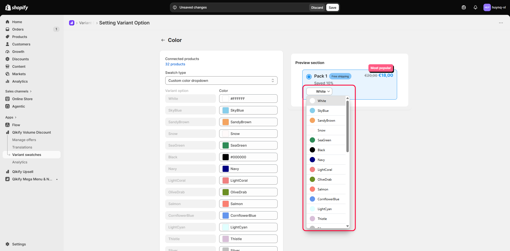
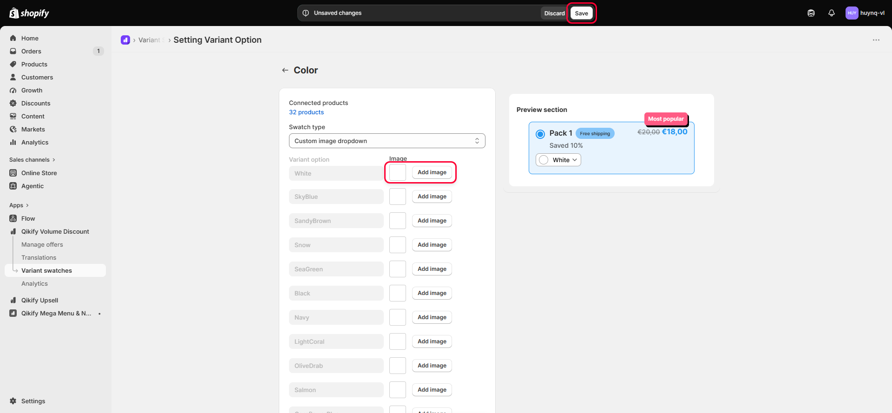

# Customizing Variant Swatches in Qikify Volume Discount

By default, variant options in a Qikify Volume Discount offer only show up as a plain-text dropdown — customers have to read "Red" or "Blue" instead of seeing the actual color. The **Variant swatches** feature lets you attach a color swatch or image next to each variant name, making it faster and more visual for customers to choose. This article walks you through opening the right configuration section, understanding the option list table, choosing a display style (swatch type), and saving your changes.

## 1. Open the Variant swatches section

In Shopify admin, open the **Qikify Volume Discount** app in the left sidebar, then click **Variant swatches** (right below **Manage offers** and **Translations**). This is where you manage the display style for every variant option used across your offers.

## 2. The Variant swatches list table

The page that opens shows a table listing each variant option in your store, with 4 columns:

1. **Variant options** — the option name exactly as set on your Shopify products (e.g. **Color**, **Size**). Different products that share the same option name share the same display style.
2. **Connected Products** — the number of synced products that have this option (click the number to see the product list).
3. **Swatch type** — the current display style for that option.
4. **Customize** — click the pencil icon to open the style editor for that option.

In the example above, the **Color** option is set to **Variant color dropdown**, while **Size** and **Available Product** are still on **Default dropdown**.

> **note:** If your store has never synced variant data, this table will be empty and you'll need to click the **Sync variants** button in the top-right corner first. This button can also be used anytime to re-sync when you add new options on Shopify.

## 3. Open the style editor for an option

Click the pencil icon in the **Customize** column for the **Color** option to open the **Setting Variant Option** page. On the left is the **Swatch type** dropdown — the main control you use to change the display style; on the right is the **Preview section**, showing exactly what the real offer will look like, and it **updates instantly** every time you change the dropdown value.

The Swatch type dropdown has 5 choices:

- **Default dropdown** — the default style, text only.
- **Custom color dropdown** — you manually assign a color to each variant.
- **Custom image dropdown** — you manually upload an image for each variant.
- **Variant color dropdown** — the app automatically pulls in existing variant colors from Shopify.
- **Variant image dropdown** — the app automatically pulls in existing variant images from Shopify.

> **note:** The **Variant color dropdown** and **Variant image dropdown** styles only work if you've already set up variant colors/images on Shopify via a category metafield. See Shopify's guide on [category metafields](https://help.shopify.com/en/manual/custom-data/metafields/category-metafields/using-category-metafields) if you haven't configured this before.

## 4. Set a custom color for each variant

Select **Custom color dropdown** in the Swatch type dropdown. A 2-column list appears below: **Variant option** (the variant name, read-only) and **Color** (the color you assign, editable). For each row, click the color square to open the color picker, or type a hex code (e.g. `#FFFFFF`) or a color name (e.g. `SandyBrown`) directly into the text field next to it — the app pre-fills a suggested color name based on the variant name, and you can keep it as-is or change it to whatever you like.

## 5. Preview the shopper experience

Click the variant control (here, **White**) in the **Preview section** to open the dropdown just as a customer would see it on the storefront. Each option now shows a small color circle next to its name, matching the color you just set in the previous step — confirming that this preview reflects **exactly what customers will see, in real time**, not a static mockup.

## 6. Or use images, then save

If you choose **Custom image dropdown** instead of colors, the list below changes to **Variant option** and **Image**: each row has an image preview box along with an **Add image** button that opens Shopify's file picker, letting you upload a dedicated image for each variant.

Whichever style you choose — color, image, or any other swatch type — always click **Save** on the **Unsaved changes** bar at the top of the page to save it. The new style will automatically update on your storefront right after saving.

> **note:** Want to discard unsaved changes? Click **Discard** right next to the Save button to revert to the most recently saved style.

And that's it — you now know how to turn on color or image swatches for any variant option in your offers, and how to save your changes so they apply to your storefront. The app is updated frequently, so if you run into any trouble while configuring it, feel free to reach out to our support team via live chat right inside the app — we're always happy to help 🤩
